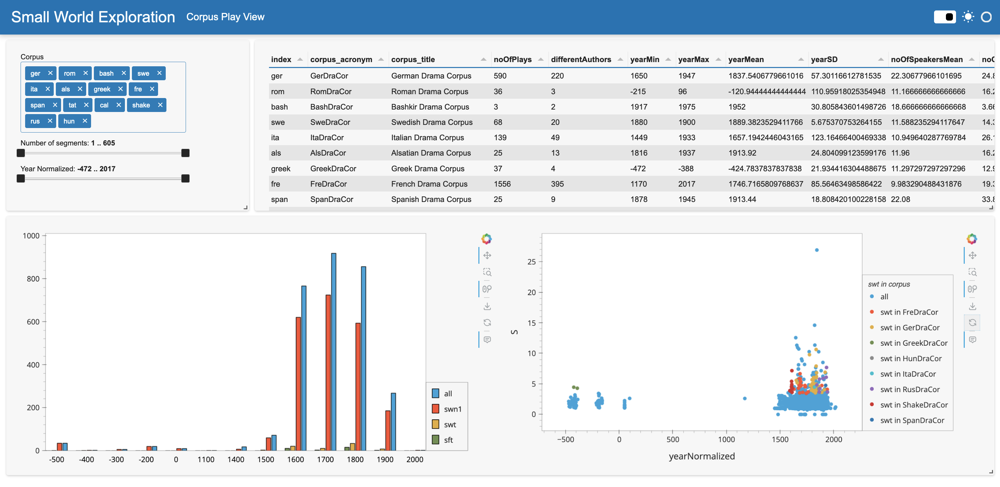
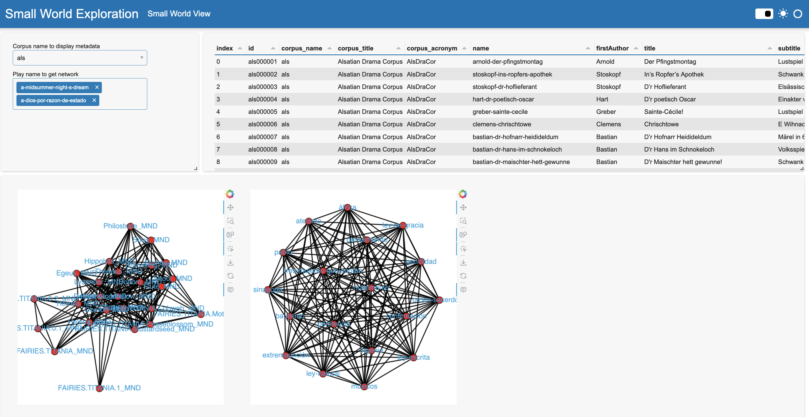

# Detecting Small Worlds in a Corpus of Thousands of Theater Plays – A DraCor Study in Comparative Literary Network Analysis

This repository contains the code and data used for the paper presented at the [Workshop on Computational Drama Analysis](https://quadrama.github.io/blog/2022/03/14/comp-drama-analysis-workshop) (September 2022) at Cologne University.

Use the branch [`conference-version`](https://github.com/dracor-org/small-world-paper/tree/conference-version) for script and data used for the analyis. The branch [`develop`](https://github.com/dracor-org/small-world-paper/tree/develop) contains the current state of the workflow creating a fully reproducible study using Docker and the "Programmable Corpus" prototype of our Very Big Drama Corpus [VeBiDraCor](https://github.com/dracor-org/vebidracor).

## Data Visualisation
This branch contains script for visualising and interacting with the [result data](https://github.com/dracor-org/small-world-paper/blob/publication-version/results/results.csv) using [Panel](https://panel.holoviz.org/).

The GUI is split into two websites: the Small World View and the Corpus Play View 
In the Small World View three parameters can be controlled by the user to filter the result file:
* The selection of corpora
* The number of segments
* The year of publication

The graphical units are updated according to the filter:
* An overview of the corpora used (comprising Table 2 and 3 in the paper)
* A historical distribution of the number of plays, comparing the number of snw1, swt and sft plays with a time step of 100 years (similar to Figure 7 in the paper)
* A historical distriution of the single plays with S as y-axis and color-coded by swt plays in the different sub-corpora (like Figure 8 in the paper)

The Corpus Play View can be used to:
1. Look at the metadata for a specific corpus
2. Display multiple networks for comparison

### Usage
The data visualisation scripts can be served with:
`panel serve explore_small_worlds.py explore_corpus_plays.py`

## Abstract

Although homogenized TEI corpora of plays from different languages are becoming more and more available, research on plays with a comparative angle is still rare in the field of Computational Literary Studies (CLS). This is where approaches of formal network analysis come into play, which have been elaborated in recent years in particular with focus on theater plays. They bear huge potential for comparative research due to their modeling of texts as asemantic structures. An attempt to integrate the paradigm of such a formal analysis with general network research on the one hand and literary history on the other hand is the approach of a typification of networks with respect to the “Small World” concept. However, studies have so far remained limited to smaller and monolingual corpora. In this study, we conceptualize different operationalizations of the “Small World” concept and apply the measures to a larger, DraCor-based corpus of almost 3,000 plays. Looking at the results of these analyses, we examine how the different operationalizations of the “Small World” concept relate to each other and discuss how they could be used for a network-based typology of dramatic forms. We finally develop initial ideas for a network-grounded history of dramatic forms in a transnational perspective.
